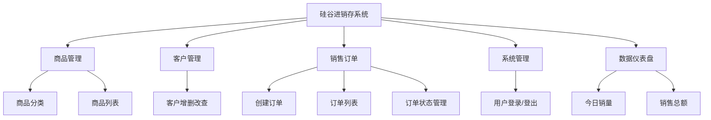
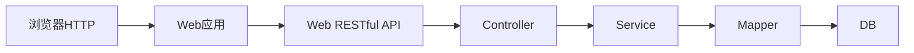

# 进销存系统 `_` 项目介绍

## 一、开发流程介绍

### `1.1` 项目开发流程

前后端分离项目的完整开发流程如下：

**第一步** （产品经理）

由产品经理负责分析市场、用户需求，并将其转化为详细的产品需求。然后创建初步的产品原型，以便更好地理解和传达产品的设计和功能。

> 原型通常指的是产品、系统或概念的初步版本或样品，旨在展示设计概念、功能、外观或其他关键特征。

**第二步**

由 `UI` 设计师基于产品需求和初步原型，设计用户界面的外观和交互，得到高保真的原型。高保真原型可能包含更具体的设计元素，如颜色、字体、布局等。

**第三步**

由架构师根据高保真原型，规划软件系统的整体结构和组件。架构师会设计**数据库架构**和**定义接口**，输出 `API` 文档，以便开发团队进行后续工作。

> `API` 文档是关于接口的详细说明文档，其会包含接口所提供的功能，所需参数、返回值、错误处理等细节。接口文档的目的是为开发人员、集成人员以及其他利益相关者提供清晰的指导，以便他们能够正确地使用和集成接口。
>
> 接口文档示例（`Knife4j`）：

**第四步**

**前后端开发工程师根据 `API` 文档，分别开发前端和后端的业务逻辑和功能**。前端工程师负责构建用户交互界面，而后端工程师负责数据处理逻辑和数据存储。

**第五步**

测试工程师进行各种测试，以确保软件的质量和稳定性。

**第六步**

运维工程师负责配置、部署和维护应用程序的生产环境，确保应用程序能够正常运行并具备良好的性能和可用性。

### `1.2` 关键点总结

| 步骤   | 人员     | 关键点                             | 产物                         |
| :----- | :------- | :--------------------------------- | :--------------------------- |
| 第三步 | 架构师   | 数据库设计和接口(`API`)文档设计    | **数据库脚本**和**接口文档** |
| 第四步 | 开发人员 | 根据**接口文档**完成前后端程序开发 | 前后端项目代码               |

**理解:**

接口文档是连接前后端的桥梁，也是开发工作的依据。

### `1.3` 接口总结和参考

- **接口(`API`)**
  - 接口(`API`)是对功能和业务的统称
  - 通常是由架构师或者后端程序员定义
  - 接口(`API`)也是工作分配和权衡工作量的基本单位
  - 接口通常使用某种网络协议进行调用,最常用的协议是 `HTTP` 协议
  - **举个例子** > 一个获取商品列表的接口，> > 接口路径：`/api/products` > > 访问方式：`GET` > > 前端传参: `page=1, size=10` > > 后台响应: `json {code: 200, message: "success", data: {records: [...], total: 100}}`

- **接口文档**
  - 记录接口描述的文档
  - 前后端同步接口的载体
  - 当数据出现争端,接口文档是唯一标准
  - **本项目接口文档**：启动后端项目后访问 `http://localhost:8080/doc.html`

## 二、硅谷进销存（`Lite-IMS`）项目概述

### `2.1` 项目业务概述

**硅谷进销存 (`Lite-IMS`)** 是一个专为中小型零售商或批发商设计的**轻量级进销存管理系统**。它解决了传统手工记账繁琐、库存数据不准、销售统计困难等痛点。

项目包含**`Web` 端管理系统**，统一面向管理员和销售人员，提供商品管理、客户管理、销售开单、库存扣减、数据报表等一站式功能。

### `2.2` 功能模块概览

系统的核心业务功能如下图所示：

各功能模块具体内容如下：

- **数据仪表盘 (`Dashboard`)**
  - 系统首页展示核心经营数据，包括商品总数、今日订单数、今日销售额等，帮助管理者快速掌握经营状况。

- **商品管理 (`Product Management`)**
  - **分类管理**：维护商品的类别（如电子产品、服装、食品），支持排序。
  - **商品列表**：管理具体的商品信息（名称、价格、库存、图片），支持按分类筛选和名称搜索。

- **客户管理 (`Customer Management`)**
  - 维护客户的基础信息（姓名、电话、地址），方便在开单时快速选择客户，并建立客户档案。

- **销售订单 (`Sales Order`)**
  - **创建订单**：核心业务功能。选择客户，添加多个商品，自动计算总价，生成订单并自动扣减对应商品的库存。
  - **订单列表**：查看历史销售记录，支持查看订单详情（包含具体的商品清单）。
  - **状态管理**：对订单状态进行流转（如：已支付、已发货、已完成、已取消）。

- **系统管理 (`System`)**
  - 提供用户登录认证功能，保障系统数据安全。

### `2.3` 核心业务流程

本项目的核心业务流程为：**基础数据录入 -> 销售开单 -> 库存扣减 -> 报表统计**。

**流程图解：**

`1`. **初始化**：管理员录入商品分类、商品信息、客户信息。 `2`. **销售**：选择客户 -> 选择商品（可多选） -> 确认金额 -> 生成订单。 `3`. **系统处理**：系统自动扣减商品库存 -> 记录订单数据。 `4`. **统计**：仪表盘实时更新今日销售数据。

### `2.4` 项目技术概述

本项目采用当前主流的**前后端分离**架构，技术选型如下：

#### 后端技术栈 (`Backend`)

- **开发语言**：`Java 17`
- **核心框架**：`Spring Boot 3.0.5` (最新稳定版)
- **`ORM` 框架**：`MyBatis-Plus 3.5.3.1` (极大简化数据库操作)
- **数据库**：`MySQL 8.0` (稳定可靠的关系型数据库)
- **接口文档**：`Knife4j 4.3.0` (基于 `OpenAPI 3` 的增强版 `Swagger`)
- **工具库**：`Lombok` (简化代码), `Jackson` (`JSON` 处理)

#### 前端技术栈 (`Frontend`)

- **核心框架**：`Vue 3` (`Composition API`)
- **`UI` 组件库**：`Element Plus` (美观、易用的组件库)
- **路由管理**：`Vue Router 4`
- **网络请求**：`Axios` (封装了拦截器，处理统一请求头和响应)
- **构建工具**：`Vite` (极速启动和打包)

#### 架构示意图

---

**总结**：本项目虽然麻雀虽小，但五脏俱全，涵盖了企业级开发的核心流程和技术规范（`RESTful API`、统一返回结果、异常处理、事务管理、接口文档等），是非常适合学习和实战的进阶项目。
